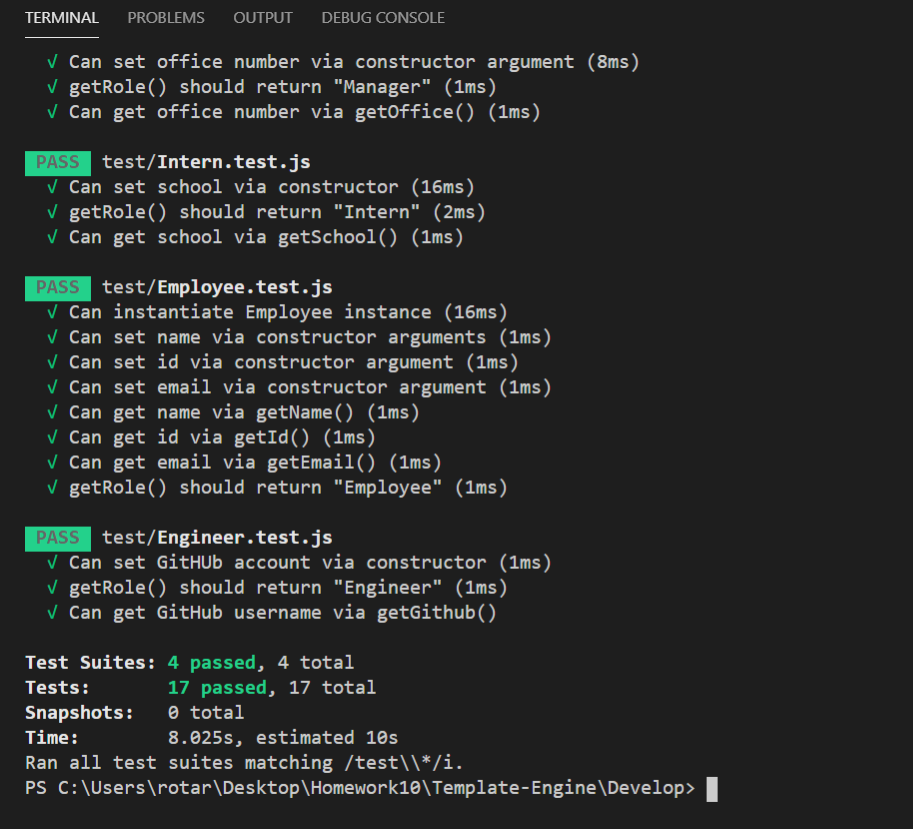

# Template-Engine

## Description:

This is a node.js application that runs on the command line that \
takes in input and creates Team cards.

## Example:

[Clickme](https://ironicminer.github.io/Template-Engine/)

## Screenshot:

## Questions:

-For questions, electronically mail me at: nathan.larson0000@gmail.com
